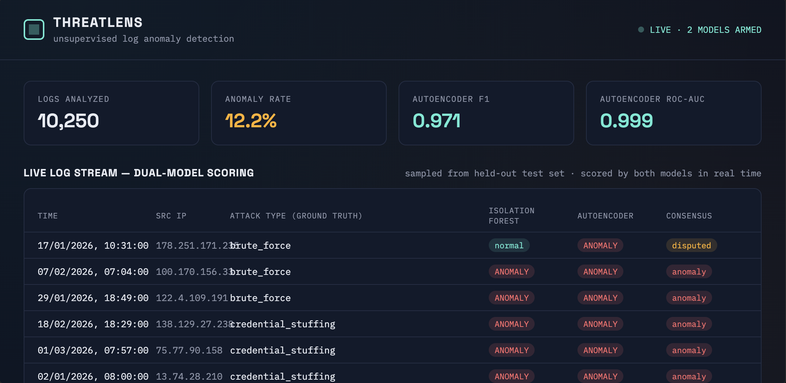
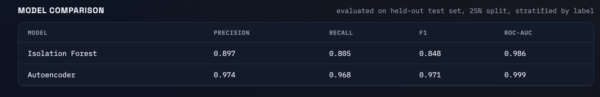

# ThreatLens — Unsupervised Log Anomaly Detection

An anomaly detection system that scores authentication + network telemetry
in real time using two unsupervised ML models, compares their strengths,
and serves predictions through a FastAPI backend with a live monitoring
dashboard.

Built to apply ML to a domain I already have real investigative experience
in (cybercrime log analysis / OSINT, Maharashtra Cyber internship) rather
than a generic dataset — the goal was an end-to-end system, not a notebook.




---

## Why this project

Most "AI project" portfolios show a model in a notebook. This one shows
the full loop a security ML engineer actually owns:

1. **Problem framing** — most real attack telemetry is unlabeled, so the
   models here are trained *unsupervised* (never see the label during
   training). Labels are used only for evaluation — a distinction worth
   being able to explain in an interview.
2. **Two competing approaches, honestly compared** — not just "I trained
   a model," but "I trained two, measured where each one fails, and can
   explain why."
3. **Deployment** — a working API + dashboard, not just `model.predict()`
   in a cell.

---

## Architecture

```
security-anomaly-detector/
├── data/
│   └── security_logs.csv          # synthetic labeled dataset (10,250 records)
├── scripts/
│   ├── generate_logs.py           # synthetic log generator w/ 5 attack patterns
│   └── train_models.py            # training, evaluation, plots
├── models/                        # trained model artifacts (joblib)
├── results/                       # confusion matrices, ROC curves, metrics
├── api/
│   ├── main.py                    # FastAPI backend
│   └── static/index.html          # live dashboard
└── requirements.txt
```

**Data flow:** `generate_logs.py` → `data/security_logs.csv` →
`train_models.py` → `models/*.joblib` + `results/*` → `api/main.py` loads
models → dashboard calls `/api/predict` for live scoring.

---

## The dataset

Real labeled attack data is scarce and sensitive (true in industry too —
security ML teams commonly build simulators for this exact reason). I
generated **10,250 synthetic records** combining authentication events and
network flow metadata per session, with realistic diurnal traffic patterns
(business-hours-weighted) and five injected, labeled attack types:

| Attack type | Signal |
|---|---|
| Brute force | many login attempts, single IP, low success rate |
| Credential stuffing | many distinct usernames from one IP, low attempts each |
| Off-hours privileged access | admin account login at 1–4am from unusual geo |
| Port scan | hundreds of distinct destination ports, near-zero bytes each |
| Data exfiltration | large outbound byte volume, long session, off-hours |

Anomaly prevalence: **12.2%** — realistic for a monitored environment,
not an artificially balanced 50/50 toy set.

---

## Models

### 1. Isolation Forest
Tree-based unsupervised outlier detector. Isolates anomalies by how few
random splits it takes to separate a point from the rest of the data —
outliers isolate faster. Industry-standard first choice for tabular
security data: fast, no distributional assumptions, interpretable score.

### 2. Autoencoder (neural network)
Trained **only on normal traffic** to compress and reconstruct 9 input
features through a bottleneck (9→6→3→6→9). Anomalies are flagged by high
**reconstruction error** — the network was never shown attack patterns, so
it reconstructs them poorly. This is the same core idea used in
production deep-learning anomaly detectors; here it's implemented with
`scikit-learn`'s `MLPRegressor` since the environment I built this in had
no internet access to install PyTorch/TensorFlow. The architecture and
training logic translate directly to `nn.Module` if you want to swap in
a PyTorch version — that's a natural next iteration.

Both models are evaluated on a **held-out 25% test set**, stratified by
label so the split reflects real attack-type distribution.

---

## Results

| Model | Precision | Recall | F1 | ROC-AUC |
|---|---|---|---|---|
| Isolation Forest | 0.897 | 0.805 | 0.848 | 0.986 |
| **Autoencoder** | **0.974** | **0.968** | **0.971** | **0.999** |

### Recall by attack type — the interesting finding

| Attack type | n | Isolation Forest recall | Autoencoder recall |
|---|---|---|---|
| Brute force | 79 | 0.962 | 1.000 |
| Credential stuffing | 50 | 1.000 | 1.000 |
| Data exfiltration | 61 | 0.984 | 1.000 |
| **Off-hours privileged access** | 67 | **0.149** | **0.851** |
| Port scan | 56 | 1.000 | 1.000 |

**Why this matters:** both models catch "loud" attacks (brute force, port
scans) near-perfectly — those have extreme outlier values in single
features. Isolation Forest almost completely **misses off-hours
privileged access (15% recall)**, because no single feature is extreme —
it's a *combination* (normal-looking session length + normal-looking byte
counts, but the wrong hour for that account). The autoencoder catches
85% of these because it learns joint feature correlations, not just
per-feature outliers.

This is a genuinely useful, explainable result: **subtle, low-and-slow
attacks that mimic normal behavior in any single dimension are exactly
where reconstruction-based models earn their complexity.** That's the
kind of finding that makes for a strong interview answer to "tell me
about a project."

---

## Running it locally

```bash
pip install -r requirements.txt

# regenerate data + retrain (optional — trained models are already included)
python scripts/generate_logs.py
python scripts/train_models.py

# run the API + dashboard
cd api
uvicorn main:app --reload --port 8000
```

Open **http://localhost:8000** — the dashboard shows live model
comparison stats, a scrolling feed of sample logs scored by both models
in real time, diagnostic plots, and a form to score your own custom
record.

### API endpoints
- `GET /api/health` — health check
- `POST /api/predict` — score one record with both models
- `POST /api/predict/batch` — score a list of records
- `GET /api/stats` — model comparison metrics
- `GET /api/sample-logs` — sample records across all attack types

---


Built by Vedant Mahadik.
